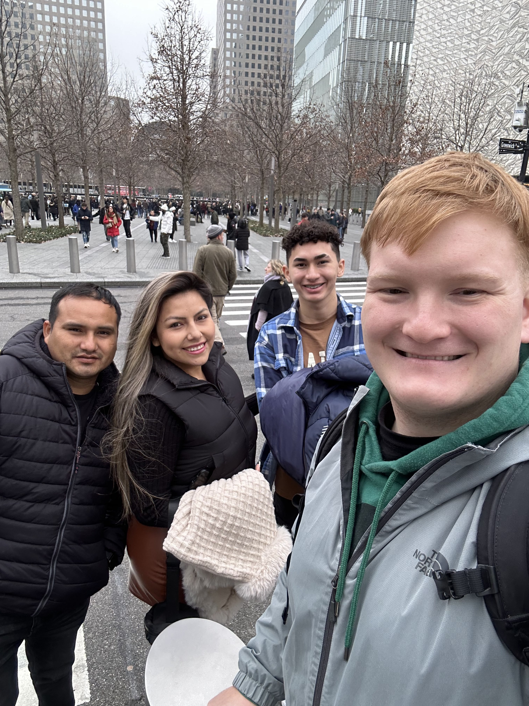
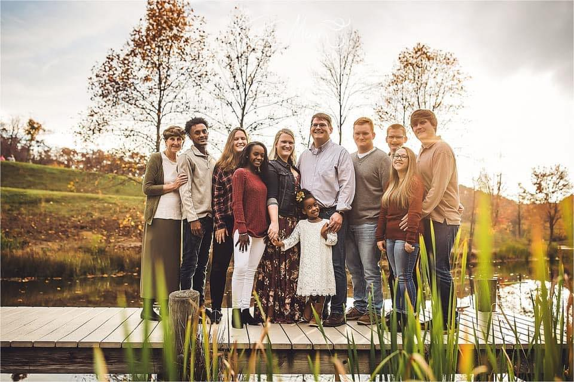

***

# <ins>**Abe Olsson**</ins>

***

### <ins>About me</ins>
I was born and raised here in Frederick, Maryland. I graduated from Hood College in 2022 earning my Bachelor's Degree in Biology. I recently got married in October of 2023 to my spouse who is from <ins>**El Salvador**</ins>. I am fluent in Spanish and I enjoy learning new things.  

  I went to NYC with my spouse and two friends visiting from Atlanta, Georgia the day after Christmas 2023. 

***

### <ins>Work Experience</ins> 
After graduating, I went to work for the US Department of Agriculture's *Agricultural Research Service* - **Foreign Disease Weed Science Research Unit** on **Fort Detrick** for one year. I currently work for **Frederick County Public Schools** as a *Resident Substitute Teacher*. I am **searching** for a **job** in the <ins>biotech industry</ins> as either an entry-level associate or an intern. 

***

### <ins>Family</ins>
I am the second oldest of 8 kids. I have 3 biological siblings and 4 adopted siblings.

#### <ins>Names</ins>

|||
|:-:|:-:|
|Ben|Jenna|
|**Abe**|Mihret|
|Eli|Frehiwot|
|Sami|Mayla|
|||

***

### <ins>Hobbies and interests</ins>
I like to : 

* Garden 

* Research immigration law

* Help members of our community get in touch with resources they need to receive social services. 

***
