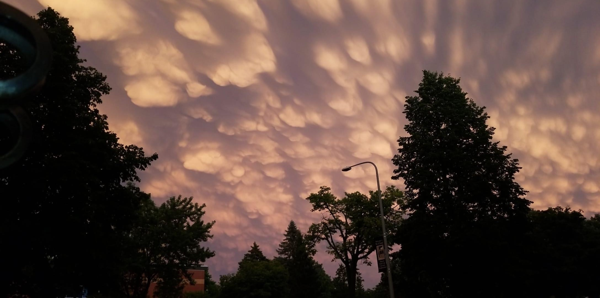

# Hamere Mogus
## About me
*I am originally from **Ethiopia** and came here for college. I studied biomedical sciences and also double majored in psychology and minored in human relations.* ***I am taking this class because of the interest in learning more about statistical computing and enhance my programming skills to analyze data in a more efficient way.***

### Work Experience
*I now work as a lab technician/chemist for a pharmaceutical company, where i formulate reference standard chemical products on the daily basis.*

#### Hobbies and Interests
-*I am a big fan of Marvel Movies.*
-*I enjoy reading Fictions and dab in Photography from time to time 

##### Class Schedule
| Date         | Reading List                   |
|--------------|--------------------------------|
| Jan 25, 2024 | Hands on programming with R    |
| Feb 1, 2024  | R for data science             |
| Feb 8, 2024  | R markdown:The defintive guide |
| Feb 15, 2024 | R for data science             |
